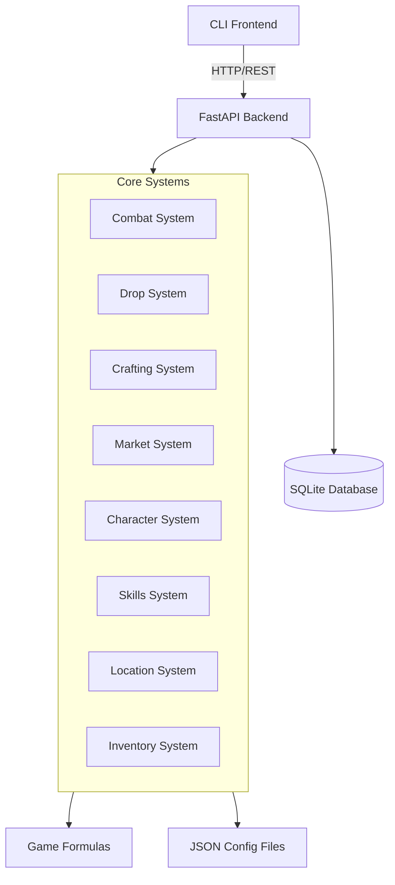

# Архитектура системы Dreamforge: Эхо Бездны

## Обзор

Dreamforge - это текстовая MMORPG с редким дропом и живой экономикой. Система построена на архитектуре клиент-сервер с REST API.

## Компоненты системы

## Структура базы данных

### Основные сущности

- **Player** - Аккаунт игрока
- **Character** - Персонаж игрока
- **Item** - Предметы игры
- **Location** - Локации мира
- **Monster** - Мобы/враги
- **Skill** - Навыки персонажа
- **DropTable** - Таблицы дропа
- **MarketOrder** - Ордера на рынке

### Связи

- Player 1:N Character
- Character 1:1 EquipmentSlot
- Character 1:N InventorySlot
- Character N:M Skill (через CharacterSkill)
- Monster 1:1 DropTable
- DropTable 1:N DropTableItem
- Location 1:N Monster
- Character N:1 Location

## API Endpoints

### Character
- `GET /api/characters/{id}` - Получить персонажа
- `POST /api/characters` - Создать персонажа
- `PUT /api/characters/{id}` - Обновить персонажа

### Combat
- `POST /api/combat/attack` - Атаковать моба
- `GET /api/combat/status` - Статус боя

### Inventory
- `GET /api/inventory/{character_id}` - Получить инвентарь
- `POST /api/inventory/equip` - Надеть предмет
- `POST /api/inventory/unequip` - Снять предмет

### Market
- `GET /api/market/orders` - Список ордеров
- `POST /api/market/orders` - Создать ордер
- `DELETE /api/market/orders/{id}` - Отменить ордер

### Location
- `GET /api/locations` - Список локаций
- `POST /api/locations/travel` - Переместиться

## Игровые системы

### Система боя
- Пошаговый бой 1 на 1
- Расчет урона по формулам
- Критические удары
- Порядок хода по скорости

### Система дропа
- Разделение на Сердцевину (Soul-Bound) и Оболочку (Tradable)
- Вероятностный дроп
- Влияние LUK на шанс

### Система крафта
- Рецепты: 1x Сердцевина + Nx Оболочка = Легендарный предмет
- Валидация ингредиентов

### Биржевая система
- Лимитные ордера
- История сделок
- Автоматическое сопоставление ордеров

## Технологический стек

- **Backend:** Python 3.10+, FastAPI, SQLAlchemy 2.0, SQLite
- **Frontend:** Python CLI с rich и prompt-toolkit
- **Database:** SQLite (MVP), миграции через Alembic
- **Config:** JSON файлы для баланса и контента

