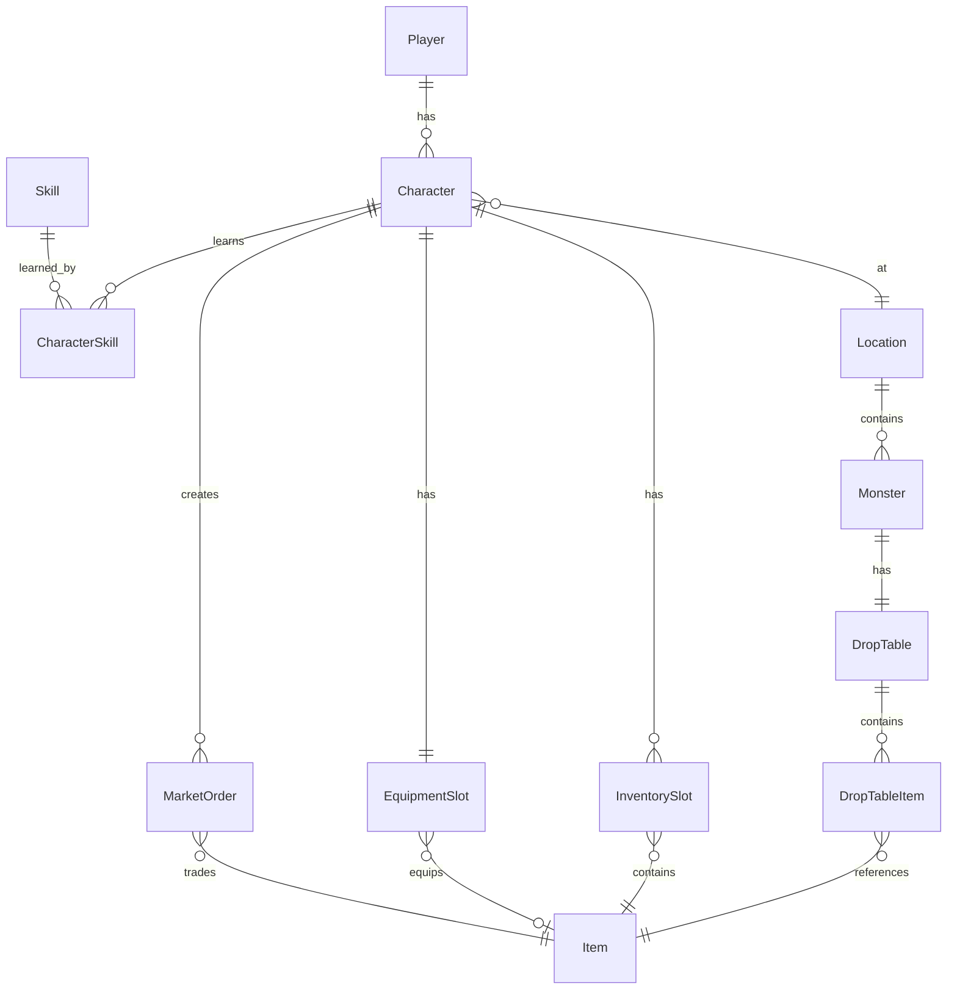

# Схема базы данных

## ER-диаграмма

## Таблицы

### players
- `id` (PK)
- `username` (unique)
- `email` (unique)
- `password_hash`
- `created_at`
- `is_active`

### characters
- `id` (PK)
- `player_id` (FK -> players)
- `name`
- `level`
- `experience`
- `strength`, `agility`, `intelligence`, `endurance`, `wisdom`, `luck`
- `character_class` (enum)
- `location_id` (FK -> locations)

### items
- `id` (PK)
- `name`
- `description`
- `rarity` (enum)
- `item_type` (enum)
- `stat_bonuses` (JSON)
- `physical_damage`, `magical_damage`
- `physical_defense`, `magical_defense`
- `crit_chance_bonus`, `speed_bonus`
- `is_soul_bound`, `is_tradable`
- `stack_size`

### inventory_slots
- `id` (PK)
- `character_id` (FK -> characters)
- `item_id` (FK -> items)
- `quantity`
- `slot_index`

### equipment_slots
- `id` (PK)
- `character_id` (FK -> characters, unique)
- `helmet_id`, `chest_id`, `belt_id`, `legs_id`, `boots_id` (FK -> items)
- `weapon_id`, `accessory1_id`, `accessory2_id` (FK -> items)

### market_orders
- `id` (PK)
- `character_id` (FK -> characters)
- `item_id` (FK -> items)
- `order_type` (enum: buy/sell)
- `status` (enum: pending/filled/cancelled/partial)
- `price`
- `quantity`, `filled_quantity`
- `created_at`, `updated_at`

### locations
- `id` (PK)
- `name` (unique)
- `description`
- `connected_locations` (JSON array)
- `travel_time`

### monsters
- `id` (PK)
- `name`
- `level`
- `location_id` (FK -> locations)
- `max_hp`, `current_hp`
- `strength`, `agility`, `intelligence`, `endurance`, `wisdom`
- `physical_damage_min`, `physical_damage_max`
- `magical_damage_min`, `magical_damage_max`
- `physical_defense`, `magical_defense`
- `speed`
- `special_abilities` (JSON array)

### drop_tables
- `id` (PK)
- `monster_id` (FK -> monsters, unique)
- `name`

### drop_table_items
- `id` (PK)
- `drop_table_id` (FK -> drop_tables)
- `item_id` (FK -> items)
- `drop_chance` (decimal)
- `min_quantity`, `max_quantity`

### skills
- `id` (PK)
- `name` (unique)
- `description`
- `skill_type` (enum)
- `required_level`
- `required_strength`, `required_agility`, etc.
- `allowed_classes` (JSON array)
- `effects` (JSON)

### character_skills
- `id` (PK)
- `character_id` (FK -> characters)
- `skill_id` (FK -> skills)
- `is_selected` (0-6, 0 = not selected)
- `learned_at_level`

## Индексы

- `characters.player_id`
- `characters.name`
- `characters.location_id`
- `items.name`
- `inventory_slots.character_id`
- `market_orders.item_id`
- `market_orders.status`
- `monsters.location_id`
- `skills.name`

